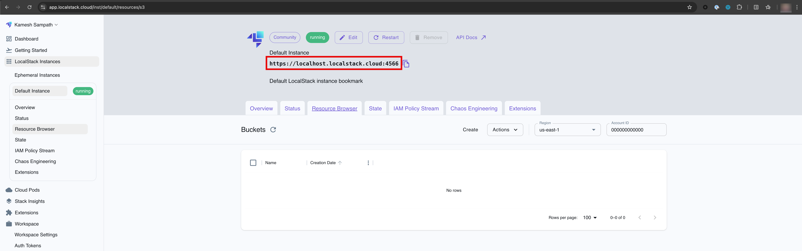
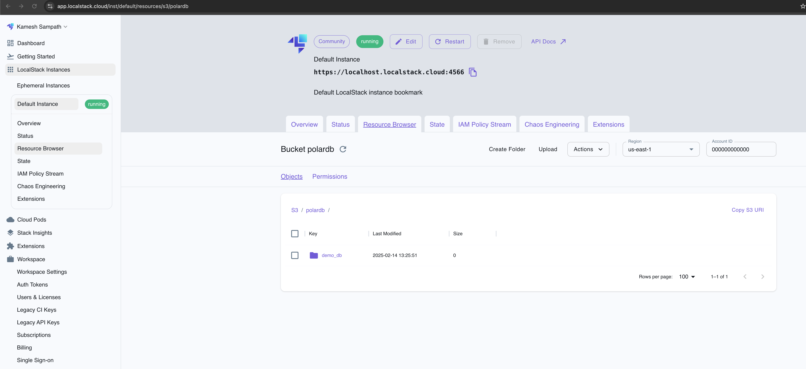
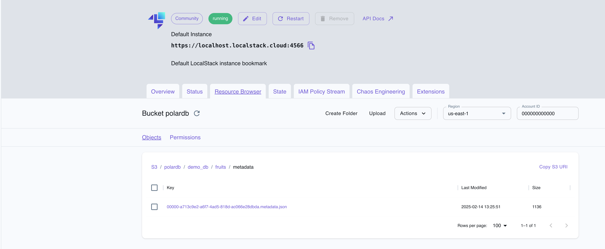
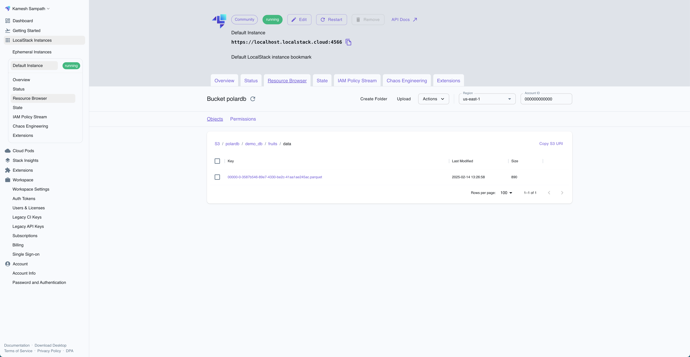

# Apache Polaris Starter Kit with LocalStack on k3s

This starter kit provides a complete development environment for Apache Polaris with LocalStack integration running on k3s Kubernetes. It includes automated setup of PostgreSQL metastore, S3 integration via LocalStack, and all necessary configurations for immediate development use. The kit uses Kustomize for Kubernetes deployments and provides utilities for secure key generation and credential management.

Key features:

- Automated k3s cluster setup with k3d
- Integrated LocalStack for AWS S3 emulation
- PostgreSQL metastore configuration
- Ansible Playbooks for setup and configuration
- Use [trino](https://trino.io) to work with Iceberg

## Prerequisites

- [Docker Desktop](https://www.docker.com/products/docker-desktop/) or [Docker Engine](https://docs.docker.com/engine/install/)
- [kubectl](https://kubernetes.io/docs/tasks/tools/#kubectl) - Kubernetes command-line tool
- [k3d](https://k3d.io/) (>= 5.0.0) - Lightweight wrapper to run [k3s](https://k3s.io) in Docker
- [Python](https://www.python.org/downloads/) >= 3.11
- [uv](https://github.com/astral-sh/uv) - Python packaging tool
- [Task](https://taskfile.dev) - Makefile in YAML
- [LocalStack](https://localstack.cloud/) (>= 3.0.0) - AWS cloud service emulator
- [Dnsmasq](https://dnsmasq.org/doc.html) - **Optional** to avoid editing `/etc/hosts`

> **Important**
> Ensure the tools are downloaded and on your path before proceeding further with this tutorial.

## Get the Sources

Clone the repository:

```bash
git clone https://github.com/kameshsampath/trino-localstack
cd trino-localstack
```

Set up environment variables:

```bash
export PROJECT_HOME="$PWD"
export KUBECONFIG="$PWD/.kube/config"
export K3D_CLUSTER_NAME=trino-localstack
export K3S_VERSION=v1.32.1-k3s1
export FEATURES_DIR="$PWD/k8s"
```

Going forward we will refer to the cloned sources folder as `$PROJECT_HOME`.

## Python Environment Setup

Install the `uv` tool:

```bash
# Using pip
pip install uv

# Or using curl (Unix-like systems)
curl -LsSf https://astral.sh/uv/install.sh | sh
```

Set up Python environment:

```bash
# Pin python version
uv python pin 3.12
# Install and set up Python environment
uv venv
# On Unix-like systems
source .venv/bin/activate
# Install deps/packages
uv sync
```

> **Tip**
> Use tools like [direnv](https://direnv.net) to make it easy setting environment variables

## DNSmasq (Optional)

For seamless access of services with the local k3s cluster and host, we might need to add entries in `/etc/hosts` of the host. But using dnsmasq is a much cleaner and neater way.

Assuming you have `dnsmasq` installed, here is what is needed to set that up on macOS:

```shell
echo "address=/.localstack/127.0.0.1" >> $(brew --prefix)/etc/dnsmasq.conf
```

```shell
cat <<EOF | sudo tee /etc/resolver/localstack
nameserver 127.0.0.1
EOF
```

### Prepare for Deployment

The following script will generate the required sensitive files from templates using Ansible:

```shell
ansible-playbook $PROJECT_HOME/polaris-forge-setup/prepare.yml
```

## Create the Cluster

Run the cluster setup script:

```bash
$PROJECT_HOME/bin/setup.sh
```

Once the cluster is started, wait for the deployments to be ready:

```shell
ansible-playbook  $PROJECT_HOME/polaris-forge-setup/cluster_checks.yml --tags=bootstrap
```

The cluster will deploy `localstack` and `postgresql`. You can verify them as shown:


### Deploy Apache Polaris

```shell
kubectl apply -k $PROJECT_HOME/k8s/polaris
```

Ensure all deployments and jobs have succeeded:

```shell
ansible-playbook  $PROJECT_HOME/polaris-forge-setup/cluster_checks.yml --tags polaris
```

### Available Services

| Service    | URL                    | Default Credentials                                                                                |
| ---------- | ---------------------- | -------------------------------------------------------------------------------------------------- |
| Polaris UI | http://localhost:18181 | $PROJECT_HOME/k8s/polaris/.bootstrap-credentials.env                                               |
| Adminer    | http://localhost:18080 | PostgreSQL host will be: `postgresql.polaris`, check $FEATURES_DIR/postgresql.yaml for credentials |
| LocalStack | http://localhost:14566 | Use `test/test` for AWS credentials with Endpoint URL as http://localhost:14566                    |

## Setup Demo Catalog

The Polaris server does not yet have any catalogs. Run the following script to set up your first catalog, principal, principal role, catalog role, and grants.

Next, we will do the following:

- Create s3 bucket
- Create Catalog named `polardb`
- Create Principal `root` with Principal Role `admin`
- Create Catalog Role `sudo`, assign the role to Principal Role `admin`
- Finally, grant the Catalog Role `sudo` to manage catalog via `CATALOG_MANAGE_CONTENT` role. This will make the principals with role `admin` able to manage the catalog.

Setup the environment variables,

```shell
# just avoid colliding with existing AWS profiles
unset AWS_PROFILE
export AWS_ENDPOINT_URL=http://localstack.localstack:4566
export AWS_ACCESS_KEY_ID=test
export AWS_SECRET_ACCESS_KEY=test
export AWS_REGION=us-east-1
```

```shell
ansible-playbook $PROJECT_HOME/polaris-forge-setup/catalog_setup.yml
```

## Trino 

Create `trino` namespace and Polaris Principal Credentials `polaris-env` secret in it: 

```shell
ansible-playbook $PROJECT_HOME/polaris-forge-setup/prepare.yml --tags=trino
```

Deploy Trino

```shell
kubectl apply -f $PROJECT_HOME/k8s/trino/trino.yaml
```

Wait for trino pods to be ready,

```shell
ansible-playbook  $PROJECT_HOME/polaris-forge-setup/cluster_checks.yml --tags=trino
```

## Verify Setup

### Using Trino 


```shell
trino --server http://localhost:18080 
```

List all catalogs

```sql
show catalogs;
```

```text
 Catalog 
---------
 iceberg 
 system  
 tpcds   
 tpch    
(4 rows)
```

Create a schema in `iceberg` named `demo_db`

```sql
create schema iceberg.demo_db;
```

Ensure the schema is created,

```sql
show schemas from iceberg;
```

Create a table named `fruits` in `iceberg.demo_db`,

```sql
create table iceberg.demo_db.fruits (
  id int,
  name varchar,
  season varchar
);
```

**THIS COMMAND FAILS WITH ERROR**

```text
Query 20250309_122744_00005_kzjfk failed: Server error: SdkClientException: Unable to execute HTTP request: Connect to polardb.localstack.localstack:4566 [polardb.localstack.localstack/127.0.0.1] failed: Connection refused
```

### Using notebooks

Generate the Juypter notebook to verify the setup,

```shell
ansible-playbook  $PROJECT_HOME/polaris-forge-setup/catalog_setup.yml --tags=verify
```

Run the `$PROJECT_HOME/notebooks/verify_setup.ipynb` to make sure you are able to create the namespace, table, and insert some data.

To double-check if we have all our iceberg files created and committed, open <https://app.localstack.cloud/inst/default/resources/s3/polardb>. You should see something as shown in the screenshots below:



> **Important**
> Default Instance URL is updated as shown





Your local Apache Polaris environment is ready for use. Please explore it further using or connect it with other query engines/tools like Apache Spark, Trino, Risingwave, etc.

## Troubleshooting

### Polaris Purge and Bootstrap

Whenever there is a need to clean and do bootstrap again, run the following sequence of commands:

```shell
kubectl patch job polaris-purge -p '{"spec":{"suspend":false}}'
```

Wait for purge to complete:

```shell
kubectl logs -f -n polaris jobs/polaris-purge
```

Scale down bootstrap and then scale it up:

```shell
kubectl delete -k k8s/polaris/job
```

```shell
kubectl apply -k k8s/polaris/job
```

Wait for bootstrap to complete successfully:

```shell
kubectl logs -f -n polaris jobs/polaris-bootstrap
```

A successful bootstrap will have the following text in the log:

```text
...
Realm 'POLARIS' successfully bootstrapped.
Bootstrap completed successfully.
...
```

Checking for pods and services in the `polaris` namespace should display:

```text
NAME                           READY   STATUS      RESTARTS   AGE
pod/polaris-694ddbb476-m2trm   1/1     Running     0          13m
pod/polaris-bootstrap-tpkh4    0/1     Completed   0          13m
pod/postgresql-0               1/1     Running     0          100m

NAME                    TYPE           CLUSTER-IP     EXTERNAL-IP             PORT(S)          AGE
service/polaris         LoadBalancer   10.43.202.93   172.19.0.3,172.19.0.4   8181:32181/TCP   13m
service/postgresql      ClusterIP      10.43.182.31   <none>                  5432/TCP         100m
service/postgresql-hl   ClusterIP      None           <none>                  5432/TCP         100m
```

### Checking Component Logs

You can use `kubectl logs` to inspect the logs of various components:

#### Polaris Server

```bash
# Check Polaris server logs
kubectl logs -f -n polaris deployment/polaris
```

#### Bootstrap and Purge Jobs

```bash
# Check bootstrap job logs
kubectl logs -f -n polaris jobs/polaris-bootstrap

# Check purge job logs
kubectl logs -f -n polaris jobs/polaris-purge
```

#### Database

```bash
# Check PostgreSQL logs
kubectl logs -f -n polaris statefulset/postgresql
```

#### LocalStack

```bash
# Check LocalStack logs
kubectl logs -f -n localstack deployment/localstack
```

### Common Issues

1. If Polaris server fails to start:

   ```bash
   # Check events in the namespace
   kubectl get events -n polaris --sort-by='.lastTimestamp'

   # Check Polaris pod status
   kubectl describe pod -n polaris -l app=polaris
   ```

2. If LocalStack isn't accessible:

   ```bash
   # Check LocalStack service
   kubectl get svc -n localstack

   # Verify LocalStack endpoints
   kubectl exec -it -n localstack deployment/localstack -- aws --endpoint-url=http://localhost:4566 s3 ls
   ```

3. If PostgreSQL connection fails:

   ```bash
   # Check PostgreSQL service
   kubectl get svc -n polaris postgresql-hl

   # Verify PostgreSQL connectivity
   kubectl exec -it -n polaris postgresql-0 -- pg_isready -h localhost
   ```

## Cleanup

Cleanup the Polaris resources:

```bash
$PROJECT_HOME/polaris-forge-setup/catalog_cleanup.yml
```

Delete the whole cluster:

```bash
$PROJECT_HOME/bin/cleanup.sh
```

## Related Projects and Tools

### Core Components

- [Apache Polaris](https://github.com/apache/arrow-datafusion-python) - Data Catalog and Governance Platform
- [PyIceberg](https://py.iceberg.apache.org/) - Python library to interact with Apache Iceberg
- [LocalStack](https://github.com/localstack/localstack) - AWS Cloud Service Emulator
- [k3d](https://k3d.io) - k3s in Docker
- [k3s](https://k3s.io) - Lightweight Kubernetes Distribution

### Development Tools

- [Docker](https://www.docker.com/) - Container Platform
- [Kubernetes](https://kubernetes.io/) - Container Orchestration
- [Helm](https://helm.sh/) - Kubernetes Package Manager
- [kubectl](https://kubernetes.io/docs/reference/kubectl/) - Kubernetes CLI
- [uv](https://github.com/astral-sh/uv) - Python Packaging Tool

### Documentation

- [Ansible](https://docs.ansible.com/ansible/latest/getting_started/index.html)
- [Ansible Crypto Module](https://docs.ansible.com/ansible/latest/collections/community/crypto/index.html)
- [Ansible AWS Module](https://docs.ansible.com/ansible/latest/collections/amazon/aws/index.html)
- [Ansible Kubernetes Module](https://docs.ansible.com/ansible/latest/collections/kubernetes/core/k8s_module.html)
- [k3d Documentation](https://k3d.io/v5.5.1/)
- [LocalStack Documentation](https://docs.localstack.cloud/overview/)
- [Kubernetes Documentation](https://kubernetes.io/docs/home/)
- [Docker Documentation](https://docs.docker.com/)

## License

This project is licensed under the Apache License 2.0 - see the LICENSE file for details.

## Contributing

Contributions are welcome! Please feel free to submit a Pull Request.
